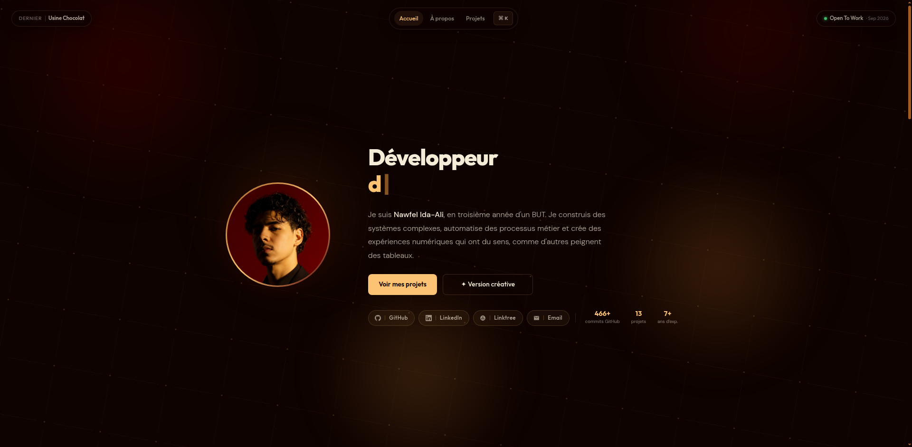

<div align="center">



# nawfel-dev — Portfolio

**Portfolio personnel de Nawfel Ida-Ali**  
Développeur Full-Stack · Strasbourg, France

[](https://nawfel-dev.vercel.app/)
[](https://react.dev/)
[](https://vitejs.dev/)
[](https://gsap.com/)
[](https://vercel.com/)

</div>

---

## ✦ Aperçu

Portfolio professionnel développé entièrement from scratch, sans template, sans UI library, avec une attention particulière portée à l'animation, à la performance et à l'expérience utilisateur.

**→ [nawfel-dev.vercel.app](https://nawfel-dev.vercel.app/)**

---

## ⚙️ Stack technique

| Couche      | Technologie                                    |
| ----------- | ---------------------------------------------- |
| Framework   | React 19                                       |
| Build       | Vite 8                                         |
| Routing     | React Router DOM 7                             |
| Animation   | GSAP 3 avec ScrollTrigger, ticker et timelines |
| Canvas      | API Canvas 2D native                           |
| Styles      | CSS vanilla modulaire                          |
| Déploiement | Vercel                                         |

Aucune dépendance CSS externe n'est utilisée. Tout le style est écrit en CSS vanilla, organisé par pages, composants et variables graphiques.

---

## 📦 Dépendances principales

Le projet utilise les dépendances suivantes :

| Dépendance         | Rôle                                               |
| ------------------ | -------------------------------------------------- |
| `react`            | Création de l'interface utilisateur                |
| `react-dom`        | Rendu de l'application React dans le DOM           |
| `react-router-dom` | Gestion des routes et de la navigation             |
| `gsap`             | Animations avancées, timelines et effets au scroll |

---

## 🛠️ Commandes disponibles

```bash
npm run dev
```

Lance le serveur de développement Vite.

```bash
npm run build
```

Génère la version de production du site.

---

## 🗂️ Structure du projet

```txt
src/
├── App.jsx                 # Composant racine, routes et palette de commandes
├── main.jsx                # Point d'entrée React
│
├── components/
│   ├── Background.jsx      # Canvas animé et soft lights avec GSAP
│   ├── CommandK.jsx        # Palette de commandes Ctrl+K
│   ├── Contact.jsx         # Section contact avec formulaire contrôlé
│   ├── CVSnippet.jsx       # Aperçu du CV sur la page d'accueil
│   ├── Header.jsx          # Header desktop avec navigation adaptative
│   ├── Hero.jsx            # Section hero avec typewriter et statistiques
│   ├── MobileNav.jsx       # Navigation mobile
│   ├── N8nWorkflow.jsx     # Affichage de workflows n8n dans les pages projet
│   ├── PillButton.jsx      # Bouton réutilisable
│   ├── ProjectCard.jsx     # Carte projet avec effets visuels
│   └── Projects.jsx        # Sliders infinis de projets
│
├── data/
│   ├── deviconMap.js       # Mapping entre technologies et icônes Devicon
│   ├── projects.js         # Données des projets du portfolio
│   └── resume.js           # Données du CV
│
├── hooks/
│   ├── useCursorGlow.js    # Effet glow suivant le curseur
│   ├── useInfiniteSlider.js # Slider infini avec drag et inertie
│   ├── usePageIntro.js     # Animation d'entrée de la page d'accueil
│   └── useTypewriter.js    # Effet machine à écrire
│
├── pages/
│   ├── CV.jsx              # Page CV complète
│   ├── Home.jsx            # Page d'accueil
│   ├── NotFound.jsx        # Page 404
│   └── Project.jsx         # Page de détail d'un projet
│
└── styles/
    ├── components.css      # Styles des composants réutilisables
    ├── cv.css              # Styles de la page CV
    ├── global.css          # Styles globaux
    ├── home.css            # Styles de la page d'accueil
    ├── notfound.css        # Styles de la page 404
    ├── project-page.css    # Styles des pages projet
    └── tokens.css          # Variables CSS et direction artistique
```

---

## 🚀 Lancer le projet en local

```bash
# Cloner le repo
git clone https://github.com/Noferu/nawfel-dev.git
cd nawfel-dev

# Installer les dépendances
npm install

# Démarrer le serveur de développement
npm run dev
```

Ouvrir [http://localhost:5173](http://localhost:5173)

```bash
# Build de production
npm run build

# Prévisualiser le build
npm run preview
```

---

## 🗃️ Projets référencés

Le portfolio présente actuellement **15 projets** couvrant plusieurs domaines : développement web, applications mobiles, automatisation, IA, interfaces interactives, visualisation de données, UX/UI et game development.

| Projet                       |    Date | Stack principale                              |
| ---------------------------- | ------: | --------------------------------------------- |
| Plateforme Onboarding Client | 05/2026 | n8n, Airtable, Gotenberg, MJML, IA            |
| Pipeline Synthèse Comptable  | 03/2026 | n8n, APIs comptables, Outlook API, Gemini     |
| Usine Chocolat               | 01/2026 | Laravel, React, WebSocket, MySQL, CI/CD       |
| Mastermind Flutter           | 01/2026 | Flutter, Dart, Material Design                |
| F.E.F.F.S                    | 12/2025 | Flutter, Firebase, Mapbox                     |
| Yasuragi                     | 11/2025 | Laravel, PHP, JavaScript, MySQL               |
| LUMA                         | 02/2025 | JavaScript, Chart.js, HTML, CSS               |
| Era Explorer                 | 06/2024 | PHP, MySQL, AJAX, Twig, MVC                   |
| Ranker                       | 05/2026 | JavaScript vanilla, HTML, CSS, algorithme Elo |
| Yuumi - Compagnon Airtable   | 05/2026 | Extension Chrome, Manifest V3, Airtable, DOM  |
| Shacolback                   | 04/2026 | Python, Discord API, Riot API, Gemini         |
| MutualMap                    | 07/2025 | Python, JavaScript, PyVis, Discord API        |
| Generosus                    | 06/2025 | JavaScript vanilla, Canvas API, Pixel Art     |
| Blind Test Multijoueur       | 03/2025 | Node.js, Socket.IO, PHP, MySQL                |
| Cook Quest                   | 06/2024 | Figma, UX/UI, Miro, tests utilisateurs        |

---

## 📄 Licence

Code source disponible à titre de référence. Contenu (textes, visuels, design) (tous droits réservés © 2026 Nawfel Ida-Ali Ou Lahsen).

---

<div align="center">
  <sub>Conçu et développé par <strong>Nawfel Ida-Ali</strong> · Strasbourg, France</sub><br/>
  <sub>
    <a href="https://nawfel-dev.vercel.app/">Site</a> ·
    <a href="https://github.com/Noferu">GitHub</a> ·
    <a href="https://linkedin.com/in/nawfel-ida-ali">LinkedIn</a> ·
    <a href="https://linktr.ee/nawfel.idaali">Linktree</a>
  </sub>
</div>